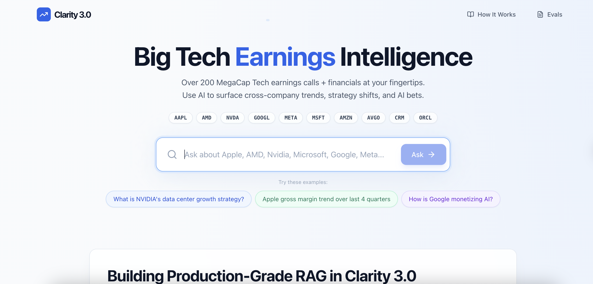
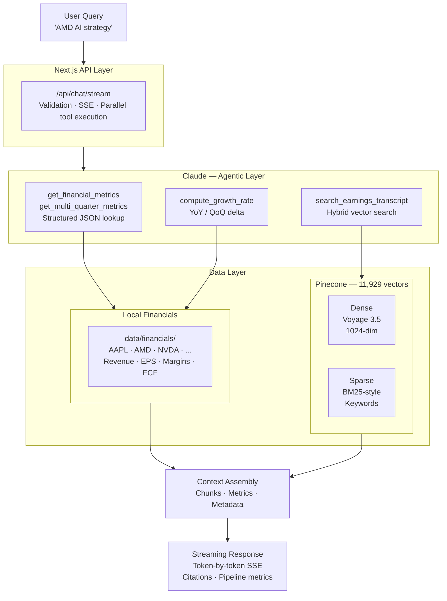
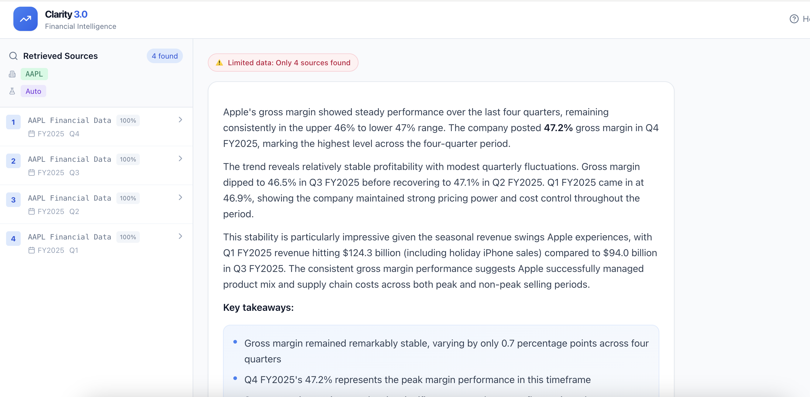
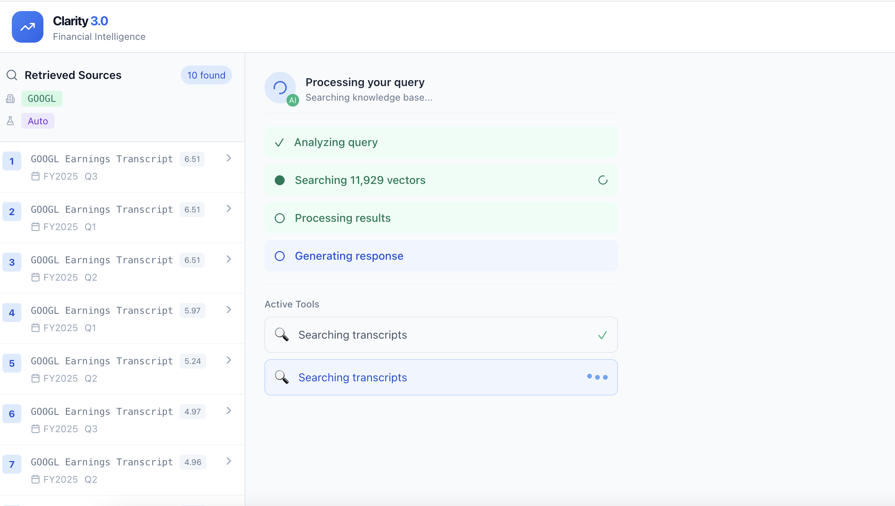
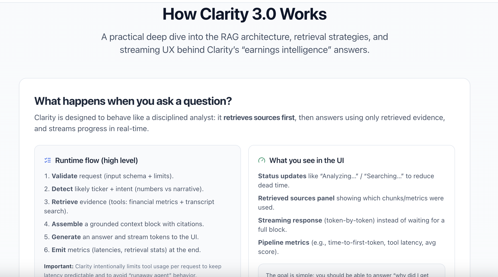

# Clarity 3.1 – Financial Intelligence RAG

A production-grade RAG system for querying 200+ earnings calls across MegaCap Tech companies. Demonstrates hybrid retrieval, agentic tool use, structured financial data pipelines, and streaming LLM integration — with a built-in evaluation framework for measuring what actually changes.


**Live demo:** https://bme-clarity-3.vercel.app/

---



---

## What This Demonstrates

| Skill Area | Implementation |
|------------|----------------|
| **RAG Architecture** | Hybrid search (dense + sparse/BM25), metadata filtering, two-lane retrieval (structured + transcript) |
| **Agentic LLM** | Claude tool use with bounded loop counts, parallel tool execution |
| **Evaluation** | Golden dataset, per-strategy scoring, dense vs. hybrid comparison with honest results |
| **Production Patterns** | Streaming SSE, async file I/O, circuit breakers, observability via Langfuse |
| **Domain Modeling** | Fiscal calendar handling per ticker, multi-format JSON extraction with fallback chains |

---

## System Architecture



---

## Key Technical Decisions

### Two-lane retrieval: structured numbers vs. transcript narrative

Asking "AAPL latest quarter gross margin" from a transcript that *discusses* margins but doesn't contain the figure creates hallucination pressure. The fix was splitting evidence into two independent lanes:

- **Structured financial JSON** for exact metrics (revenue, EPS, margins, FCF, segments). Deterministic lookup via `get_financial_metrics` / `get_multi_quarter_metrics`. Numbers come from tool output, not text extraction.
- **Transcript chunks** for narrative (strategy, guidance, competitive commentary). Retrieved via hybrid search from Pinecone.

The model receives grounded, typed evidence. "Not found in provided sources" is a correct answer when the data isn't there.

### Hybrid search — where it helps and where it doesn't

Dense embeddings are good at semantic similarity and bad at exact match. "Q2 FY2025" and "Q3 FY2025" are semantically close. They are not interchangeable.

BM25 sparse vectors let exact tokens matter again — tickers, product names, period strings. The combination handles both "what is Google's AI strategy" (semantic) and "Q3 FY2025 gross margin" (exact term).

**The real-world result is more nuanced than the theory.** A 10-query head-to-head run (December 2025) found:

| | Dense | Hybrid |
|-|-------|--------|
| **Cases won** | 5 | 2 |
| **Ties** | 3 | 3 |
| **Avg latency** | 425ms | 248ms |

Hybrid wins on exact metric/period queries — it correctly retrieved AMD's Q3 2024 revenue where dense returned 2025 data instead. Dense wins on open-ended narrative and strategy queries — hybrid's BM25 signal frequently surfaces financial JSON chunks when the question calls for transcript prose.

The practical takeaway: hybrid retrieval matters for precision on named entities and periods. For broad thematic questions, dense-only is often better. Current production config routes by intent rather than applying one strategy everywhere.

### Fiscal calendar handling

"Latest quarter" differs across tickers. NVIDIA's fiscal year ends in January; most others end in December. Without per-company calendar awareness, "Compare NVDA vs AMD latest quarter" silently compares mismatched periods.

Clarity resolves "latest" per ticker using the most recent available quarter in the local dataset, and surfaces the mismatch when cross-company periods don't align.

### Chunking

```
┌─────────────────────────────────────────────────────────┐
│  1500 chars │◀──200 overlap──▶│ 1500 chars │◀──200...   │
└─────────────────────────────────────────────────────────┘
```

Section-aware: prepared remarks and Q&A sections are chunked separately. Speaker transitions are preserved across chunk boundaries via overlap.

### Agentic tool use

Claude selects tools based on intent. Tool calls within a single response execute in parallel (`Promise.all`). Loop count is bounded at 4 iterations with a hard cap of 6 total tool calls per request to prevent runaway agent behavior.

| Query type | Tool | Data source |
|------------|------|-------------|
| Exact metric | `get_financial_metrics` | Structured JSON |
| Trends ("last 4 quarters") | `get_multi_quarter_metrics` | Structured JSON |
| Strategy / guidance / narrative | `search_earnings_transcript` | Transcript chunks |
| Growth deltas (YoY/QoQ) | `compute_growth_rate` | Computed from metrics |

---

## Example Queries



*Exact metric lookup: "AAPL latest quarter revenue and gross margin" — pulled from structured JSON, not text extraction.*



*Narrative retrieval: strategy question routed to transcript chunks, with visible source citations.*

---

## Data Coverage

| Metric | Value |
|--------|-------|
| **Tickers** | 10 (AAPL, AMD, AMZN, AVGO, CRM, GOOGL, META, MSFT, NVDA, ORCL) |
| **Years** | FY2020 – FY2025 |
| **Total Vectors** | 11,929 |
| **Transcript Files** | 571 |
| **Structured Financials** | Revenue, EPS, margins, FCF, segments |

---

## Performance

| Metric | Baseline | Current | Change |
|--------|----------|---------|--------|
| Avg total latency | 19.5s | 8.8s | −55% |
| Relevance score | 77.3% | 82.1% | +4.8pp |
| Faithfulness | 77.0% | 89.5% | +12.5pp |
| Accuracy | 65.0% | 79.5% | +14.5pp |

Latency improvements came from parallelizing tool execution, switching to async file I/O, and removing an artificial per-chunk streaming delay. The accuracy gains came from fixing retrieval failures upstream of generation — the model getting the wrong evidence, or no evidence, was the primary failure mode.

---

## How It Works



The in-app "How It Works" page documents the runtime flow, evidence sources, retrieval strategy, and SSE event types. Responses include a visible pipeline metrics panel (time to first token, tool latency breakdown, retrieval scores) so results are auditable without reading logs.

---

## Project Structure

```
clarity-3.1/
├── src/
│   ├── app/
│   │   ├── api/chat/stream/     # Streaming chat endpoint (SSE)
│   │   ├── components/          # React components
│   │   ├── evals/               # Evaluation dashboard UI
│   │   └── lib/llm/             # Claude & Voyage clients
│   └── lib/
│       ├── rag/                 # RAG pipeline components
│       │   ├── pipeline.js      # Orchestrator
│       │   ├── retriever.js     # Hybrid search wrapper
│       │   ├── sparseVectorizer.js
│       │   └── components.js    # Embedder, Retriever, Analyzer
│       ├── tools/               # Claude tool definitions + executor
│       ├── prompts/             # System prompts + guardrails
│       ├── evaluation/          # Evaluator + strategy registry
│       └── data/                # Financial data loaders
├── data/
│   ├── financials/              # Structured JSON (by ticker/FY/Q)
│   └── transcripts/             # Earnings call transcripts
├── dense-vs-hybrid-comparison.json   # Head-to-head retrieval benchmark
└── _cleanup/                    # Non-core dev artifacts
    ├── scripts/                 # Embedding + evaluation scripts
    └── evals/                   # Per-run evaluation reports
```

---

## Evaluation


The eval dashboard runs a fixed golden dataset of questions against the live system and scores each response on relevance, faithfulness, and accuracy.

### Current scores (December 10, 2025)

| Category | Accuracy range | Notes |
|----------|---------------|-------|
| Unanswerable | 80–100% | Refuses to hallucinate rather than guessing |
| Financial (metric exists) | 85–100% | Deterministic when data is present |
| Strategy / narrative | 75–100% | Degrades when transcript coverage is thin |
| Cross-company comparison | 30–60% | Hardest category; fiscal calendar alignment is the primary failure |
| Executive commentary / guidance | 20–60% | Chunking and attribution still need work |

### Dense vs. hybrid: what the data actually shows

A 10-query head-to-head benchmark (`dense-vs-hybrid-comparison.json`) produced a result that cuts against the standard narrative:

**Dense won 5 cases. Hybrid won 2. Three ties.**

Hybrid's advantage was on exact-period and named-entity queries — it correctly retrieved AMD's Q3 2024 revenue where dense surfaced 2025 data instead, and handled "Google Cloud growth rate Q4 2024" better than dense. Where hybrid failed was on open-ended strategy and guidance questions: BM25 signal consistently pulled financial JSON chunks when the query needed transcript prose (Meta AI infrastructure, Oracle FY2026 guidance, Broadcom networking strategy).

The lesson isn't "use hybrid" or "use dense." It's that query type determines which retrieval mode wins. The current production approach routes by intent rather than applying one strategy universally.

---

## Benchmark Methodology

### Query set design

10 queries covering 6 distinct failure modes observed in development:

| Query type | Example | What it tests |
|------------|---------|--------------|
| `exact-number` | "AMD Q3 2024 revenue" | Period precision, exact quarter retrieval |
| `product-specific` | "NVDA comments on MI300 competition" | Named entity match (competitor chip) |
| `multi-company` | "Compare AMD and NVDA data center strategies" | Cross-ticker retrieval balance |
| `strategic` | "Meta's approach to AI infrastructure investment" | Semantic understanding, narrative coverage |
| `guidance` | "Oracle FY2026 cloud revenue guidance" | Forward-looking content, fiscal year precision |
| `metric` | "Google Cloud growth rate Q4 2024" | Segment-level metric with period filter |
| `trend` | "Azure revenue over the past year" | Temporal reasoning, multi-quarter retrieval |
| `competitive` | "Broadcom advantages in AI networking" | Domain-specific positioning language |
| `quote` | "What did Tim Cook say about Apple Intelligence" | Speaker attribution, named person match |
| `product` | "Salesforce AI product announcements" | Announcement vs. financial data distinction |

### Scoring rubric

Each case is evaluated by an LLM judge on a 1–5 scale:

| Score | Meaning |
|-------|---------|
| 5 | Directly answers the question with correct, specific information |
| 4 | Mostly relevant, minor gaps or imprecision |
| 3 | Partially relevant; answer is incomplete or adjacent to what was asked |
| 2 | Mostly irrelevant; contains some related content but misses the point |
| 1 | No relevant content retrieved; completely wrong evidence |

### Failure taxonomy

Three recurring failure patterns in retrieval:

**Wrong content type.** Strategy questions pull financial JSON; metric questions pull narrative prose. The fix is intent-based routing, not better search. This was the most common failure mode in early versions.

**Period bleed.** Dense embeddings treat adjacent quarters as similar. "Q3 FY2025" and "Q4 FY2025" are semantically close, factually different. Hybrid retrieval with metadata filtering reduces this, but doesn't eliminate it — especially when the requested period isn't well-represented in the index.

**Coverage gaps.** If a company, quarter, or topic isn't in the dataset, no retrieval strategy recovers it. "Not found in provided sources" is the correct answer; the failure is when the system confabulates one instead. Grounding rules (no claim without evidence in tool output) are the mitigation.

---

## Setup

```bash
npm install
cp .env.local.example .env.local   # add your API keys
npm run dev
```

**Required env vars:**

```bash
ANTHROPIC_API_KEY=sk-ant-...
PINECONE_API_KEY=...
PINECONE_INDEX=...
VOYAGE_API_KEY=...
```

**Optional (observability):**

```bash
LANGFUSE_SECRET_KEY=...
LANGFUSE_PUBLIC_KEY=...
LANGFUSE_HOST=https://cloud.langfuse.com
```

---

## Stack

- [Voyage AI](https://www.voyageai.com/) – `voyage-3.5` embeddings
- [Pinecone](https://www.pinecone.io/) – Vector database with hybrid search
- [Anthropic Claude](https://www.anthropic.com/) – LLM with tool use
- [Next.js 15](https://nextjs.org/) – Framework + SSE streaming
- [Langfuse](https://langfuse.com/) – Observability (optional)
